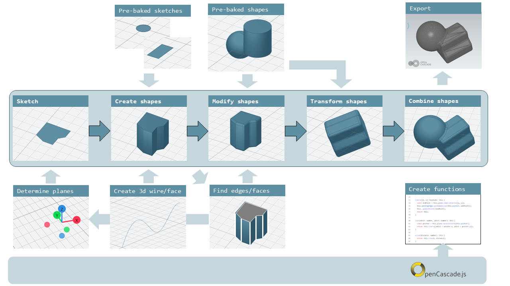
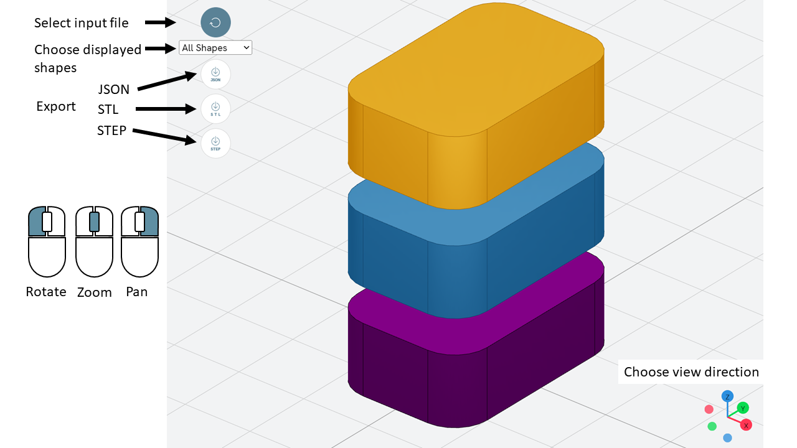
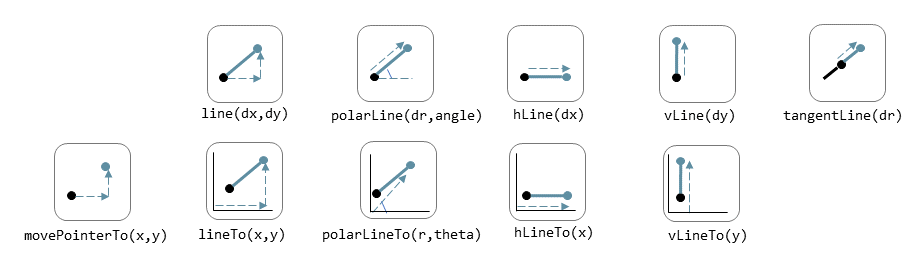
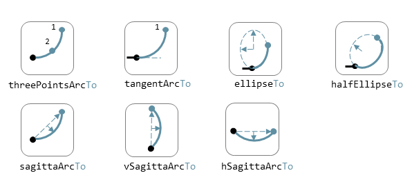
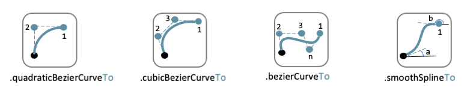
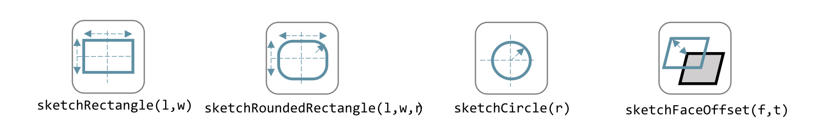
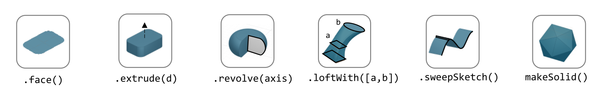
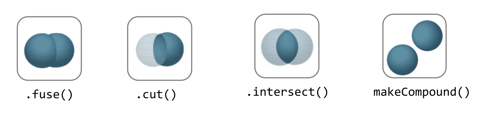

# Process [_process]

The process to draw a shape in Replicad looks like this:



Replicad is a library that is based on another library library called
opencascade.js (see <https://github.com/donalffons/opencascade.js>). The
functions in this library are explained at <https://ocjs.org/>. There
are Replicad functions that are close to the opencascade kernel but also
more user friendly functions that shield the user from the complexity of
this library. The normal flow to define a shape is to start with a
2-dimensional sketch of the shape, then use a function like extrude or
revolve to define a 3 dimensional shape. This 3 dimensional shape can
then be modified, for example by rounding edges. In its simplest form
this modification is applied to all edges at once. A more advanced
approach is to select individual edges or faces to apply the
modification. When the shape is complete it can be transformed, for
example by translating, rotating et cetera. Finally a shape can be
combined with another shape. Combinations can mean fusing the shapes
together, subtracting one shape from the other or finding the
intersection between two shapes.

A beginner can start with the pre-baked shapes to shorten the path to
determine a shape. There are 2 dimensional pre-baked shapes like
rectangles and circles, and 3 dimensional shapes like spheres or
cylinders.

# Visualiser [_visualiser]

A model in Replicad is built using a javascript input file (see next
Section). This file defines a "main" function that should return the
shapes that you want to visualise or export. The easiest way to check
that the part is generated correctly and to export the result is to use
the **Visualiser** that is offered on the Replicad site
<https://studio.replicad.xyz/visualiser>.



The Visualiser supports exporting to JSON, STL and STEP format.

# File template [_file_template]

The template to create and display a 3D part in Replicad looks like
this.

```javascript
// next lines allow intellisense help in VS Code
/** @typedef { typeof import("replicad") } replicadLib */
/** @type {function(replicadLib, typeof defaultParams): any} */

function main(
{
    Sketcher,
    sketchRectangle,
    .. functions used in the code below ..
})
{
    // add code to describe the shape
return  shape   |
return  {shape: [shape], highlight: [foundFeature]}
}
```

Alternatively you can use the arrow notation for the javascript function

```javascript
const main = (
  { Sketcher, sketchRectangle, ... },
  {}
) => {
    // add code to describe the shape
return  shape   |
return  {shape: [shape], highlight: [foundFeature]}
}
```

# Sketch [_sketch]

To start a sketch, use the `new Sketcher` command

```javascript
let sketch = new Sketcher("XZ",-5)
".sketchCommands"        (see below)
.close()                    // ends the sketch with line to starting point
.done()                     // ends the sketch without closing
.closeWithMirror()          // closes the sketch with mirror on axis from start to end
```

Use the following ".sketchCommands" to describe the sketch:

## Lines [_lines]



Lines can be sketched using the line functions. Be aware that points are
generally defined as a tuple or array, i.e. enclosed in square brackets.
This array either contains the absolute distance in the x and y
direction from the origin, or the distance and angle in case of polar
coordinates. Relative distances to the x- and y-axis are defined as two
separate values dx and dy.

|                                |                                                         |
| ------------------------------ | ------------------------------------------------------- |
| `.movePointerTo([x,y])`        | move pointer without drawing, can only be used at start |
| `.lineTo([x,y])`               | line to absolute coordinates                            |
| `.line(dx,dy)`                 | line to relative coordinates                            |
| `.vLineTo(y)`                  | vertical line to absolute y                             |
| `.vLine(dy)`                   | vertical line to relative y                             |
| `.hLineTo(x)`                  | horizontal line to absolute x                           |
| `.hLine(dx)`                   | horizontal line to relative x                           |
| `.polarLineTo([radius,theta])` | line to absolute polar coordinates                      |
| `.polarLine(distance,angle)`   | line to relative polar coordinates                      |
| `.tangentLine(distance)`       | tangent extension over distance                         |

## Arcs and ellipses [_arcs_and_ellipses]



The following commands are available to create circular and elliptical
arcs in your sketch. Just as with lines be aware that points are
generally defined as a tuple or array, i.e. enclosed in square brackets.
Relative distances to the x- and y-axis are defined as two separate
values dx and dy. The elliptic curves can be defined in more detail with
three extra parameters. If the values are omitted the default values are
used.

|                                              |                                                                          |
| -------------------------------------------- | ------------------------------------------------------------------------ |
| `.threePointsArcTo(point_end,point_mid)`     | arc from current to end via mid, absolute coordinates                    |
| `.threePointsArc(dx,dy,dx_via,dy_via)`       | arc from current to end via mid, relative coordinates                    |
| `.sagittaArcTo(point_end,sagitta)`           | arc from current to end with sag , absolute coordinates                  |
| `.sagittaArc(dx,dy,sagitta)`                 | arc from current to end with sag, relative coordinates                   |
| `.vSagittaArc(dy,sagitta)`                   | vertical line to endpoint with sag, relative y                           |
| `.hSagittaArc(dx,sagitta)`                   | horizontal line to endpoint with sag, relative x                         |
| `.tangentArcTo([x,y])`                       | arc tangent to current line to end, absolute coordinates                 |
| `.tangentArc(dx,dy)`                         | arc tangent to current line to end, relative coordinates                 |
| `.ellipseTo([x,y],r_hor,r_vert)`             | ellipse from current to end, absolute coordinates, radii to hor and vert |
| `.ellipse(dx,dy,r_hor,r_vert)`               | ellipse from current to end, relative coordinates, radii to hor and vert |
| `.ellipse(dx,dy,r_h,r_v,a_start,a_end,true)` | extra parameters ellipse: startangle, endangle, counterclockwise?        |
| `.halfEllipseTo([x,y],r_min)`                | half ellipse with r_min as sag, absolute coordinates                     |
| `.halfEllipse(dx,dy,r_min)`                  | half ellipse with r_min as sag, relative coordinates                     |

## Free form curves [_free_form_curves]



|                                                      |                                                      |
| ---------------------------------------------------- | ---------------------------------------------------- |
| `.bezierCurveTo([x,y],points[])`                     | Bezier curve to end along points\[\]                 |
| `.quadraticBezierCurveTo([x,y],[x_ctrl,y_ctrl])`     | Quadratic bezier curve to end with control point     |
| `.cubicBezierCurveTo([x,y],p_ctrl_start,p_ctrl_end)` | Cubic bezier curve with begin and end control points |
| `.smoothSplineTo([x,y],splineconfig)`                | smooth spline to end, absolute coordinates           |
| `.smoothSpline(dx,dy,splineconfig)`                  | smooth spline to end, absolute coordinates           |
| ``                                                   | ``                                                   |

# Pre-baked sketches [_pre_baked_sketches]



|                                     |                                                                          |
| ----------------------------------- | ------------------------------------------------------------------------ |
| `sketchRectangle(length,width)`     | create a sketch of a rectangle with length and width                     |
| ``                                  | create a sketch of a rounded rectangle                                   |
| ``                                  | create a sketch of a circle                                              |
| `sketchFaceOffset(shape,thickness)` | create a sketch by defining an offset from an existing face in the scene |

# Create 3D face/wire [_create_3d_face_wire]

## Create wires in 3D [_create_wires_in_3d]

In comparison to sketches which create wires or faces in 2D

|                                                                             |     |
| --------------------------------------------------------------------------- | --- |
| `makeLine([point],[point])`                                                 |     |
| `makeCircle(radius,[center],[normal])`                                      |     |
| `makeEllipse(major,minor,[center],[normal])`                                |     |
| `makeHelix(pitch,height,radius,[center],[dir],lefthand?)`                   |     |
| `makeThreePointArc([point1],[point2],[point3])`                             |     |
| `makeEllipseArc(major,minor,anglestart,angleEnd,[center],[normal],[xDir?])` |     |
| `makeBSplineApproximation([points[]])`                                      |     |
| `makeBezierCurve([points[]])`                                               |     |
| `makeTangentArc([startPoint],[tangentPoint],[endPoint])`                    |     |

## Create faces in 3D [_create_faces_in_3d]

|                                     |     |
| ----------------------------------- | --- |
| `makeFace(wire)`                    |     |
| `makeNewFaceWithinFace(face,wire)`  |     |
| `makeNonPlanarFace(wire)`           |     |
| `makePolygon(points[])`             |     |
| `makeOffset(face,offset,tolerance)` |     |
| `makePlaneFromFace()`               |     |

# Create shapes [_create_shapes]



shape = sketch."thicknessCommand"

|                                                           |                                                                                                                                                                                                                 |
| --------------------------------------------------------- | --------------------------------------------------------------------------------------------------------------------------------------------------------------------------------------------------------------- |
| `.face()`                                                 | Create a face from the sketch. Note that this is not needed in most needed as a closed sketch already is translated into a face that can be used directly for extrusion, revolving or sweeping.                 |
| `.extrude(distance,extrusionConfig?)`                     | extrude a face over a distance normal to the face. In the extrusion configuration it is possible to define a different extrusion direction, a certain profile for the extrusion and a twist over the extrusion. |
| ``                                                        | extrusionConfig                                                                                                                                                                                                 |
| ``                                                        | extrusionProfile                                                                                                                                                                                                |
| `.loftWith([otherSketches],loftConfig,returnShell?)`      | build a solid through lofting between different wires                                                                                                                                                           |
| `{ endPoint:[point], ruled: boolean, startPoint:[point]}` | loftconfig                                                                                                                                                                                                      |
| `.revolve(revolutionAxis:[point],config?)`                | revolve a face around the z-axis to create a solid shape. Adapt the axis of rotation and the origin in the configuration.                                                                                       |
| `origin:[point]`                                          | config                                                                                                                                                                                                          |
| `.sweepSketchplaneplane;`                                 |                                                                                                                                                                                                                 |
|                                                           | `makeSolid(faces[]/shell)`                                                                                                                                                                                      |

```javascript
            function sketchFunction(plane,origin)
            {let section = new Sketcher(plane,origin)
                    (add sketch commands)
                    .close()
            return section}
```

# Pre-baked shapes [_pre_baked_shapes]

|                                                      |     |
| ---------------------------------------------------- | --- |
| `makeCylinder(radius,height,[location],[direction])` |     |
| `makeSphere(radius)`                                 |     |
| `makeVertex([point])`                                |     |

# Modify shapes [_modify_shapes]

|                                    |                                                                                                                                                                                                                       |
| ---------------------------------- | --------------------------------------------------------------------------------------------------------------------------------------------------------------------------------------------------------------------- |
| `.fillet(radiusConfig,filter?)`    | round an edge of a shape with a fixed radius or a radius that is defined by a function. The filter refers to the selection mechanism defined in the next secion. It has the general shape of (e) ⇒ e.inDirection("X") |
| `.chamfer(radiusConfig,filter?)`   | take of a sharp edge by creating a transitional face, default at 45 degrees to a edge                                                                                                                                 |
| ``                                 | create a thin walled object from a shape, removing the indicated face from the shape to provide access to the hollow inside.                                                                                          |
| `makeOffset(shape,thickness)`      | create a shape that is offset from the original shape by the thickness. A positive number results in an increased size of the shape, a negative value will result in a smaller shape                                  |
| `addHolesInFace(face,holeWires[])` | create a hole in a shape using the wires that are indicated in the parameters to this function.                                                                                                                       |

# Find features [_find_features]

## Faces [_faces]

```javascript
let foundFaces = new FaceFinder().inPlane("XZ", 35);
```

|                                         |                                                                                                                                                                                   |
| --------------------------------------- | --------------------------------------------------------------------------------------------------------------------------------------------------------------------------------- |
| `.inPlane("XZ",35)`                     |                                                                                                                                                                                   |
| `.ofSurfaceType("CYLINDRE")`            |                                                                                                                                                                                   |
|                                         | surface types : "PLANE" / "CYLINDRE" / "CONE" /"SPHERE"/ "TORUS" / "BEZIER_SURFACE" /"BSPLINE_SURFACE"/"REVOLUTION_SURFACE"/"EXTRUSION_SURFACE"/ "OFFSET_SURFACE"/"OTHER_SURFACE" |
| `.containsPoint([0,-15,80])`            |                                                                                                                                                                                   |
| `.atAngleWith(direction,angle)`         | atAngleWith("Z",20)                                                                                                                                                               |
| `.atDistance(distance,point)`           |                                                                                                                                                                                   |
| `.inBox(corner1,corner2)`               |                                                                                                                                                                                   |
| `.inList(elementList[])`                |                                                                                                                                                                                   |
| `.inPlane(inputPlane,origin)`           | inPlane("XY",30)                                                                                                                                                                  |
| `.parallelTo(plane/face/standardplane)` |                                                                                                                                                                                   |
| ``                                      | returns all the elements that fit the filters                                                                                                                                     |

    new FaceFinder().inPlane("XZ", 30).find(house)

## Edges [_edges]

|                                                |                                                    |
| ---------------------------------------------- | -------------------------------------------------- |
| `.inDirection([x,y,z]/"X"/"Y"/"Z")`            | find all edges that have the direction             |
| `.ofLength(number)`                            | find all edges with a particular length            |
| `.ofCurveType( todo?)`                         | find all edges of a certain curve type             |
| `.parallelTo(plane / StandardPlane e.g. "XY")` | find all edges parallel to a stanadard plane       |
| `.inPlane(PlaneName / Plane)`                  | find all edges that are exactly in a defined plane |
| `.shouldKeep todo?`                            | tbd                                                |

## Combine filters [_combine_filters]

|          |                                                           |
| -------- | --------------------------------------------------------- |
| `and`    | both filters should be applied                            |
| `either` | only one of the filters may be applied                    |
| `not`    | select all other edges than those selected by this filter |

```javascript
const houseSides = new FaceFinder().either([
  (f) => f.inPlane("YZ", 50),
  (f) => f.inPlane("YZ", -50),
]);

const frontWindow = new EdgeFinder()
  .ofCurveType("CIRCLE")
  .not((f) => f.inPlane("XZ"));
```

# Transform shapes [_transform_shapes]

The transform functions require a shape or face. A sketch cannot be
transformed, with the exception of creating an offset.

transformedShape = shape."transformCommand"

|                                                      |     |
| ---------------------------------------------------- | --- |
| `"transformCommand = "`                              |     |
| `.translate([dx,dy,dz])`                             |     |
| `.translateX(dx)`                                    |     |
| `.translateY(dy)`                                    |     |
| `.translateZ(dz)`                                    |     |
| `.rotate(angleDeg,axisOrigin[x,y,x],axisEnd[x,y,x])` |     |
| `.scale(number)`                                     |     |
| `.mirror("YZ",[-10,0])`                              |     |
| `.clone()`                                           |     |

# Combine shapes [_combine_shapes]



|                                |                                                                                                                            |
| ------------------------------ | -------------------------------------------------------------------------------------------------------------------------- |
| `.cut(tool,optimisation?)`     |                                                                                                                            |
| `.fuse(otherShape,.. )`        | fuse the othershape with the shape. Other applications call this a "union" between to shapes                               |
| `.intersect(tool)`             | find the volume that is common to the two shapes considered in this method, other applications call this function "common" |
| `compoundShapes(shapeArray[])` | this function is identical to makeCompound                                                                                 |
| `makeCompound(shapeArray[])`   | allows to combine an array of any type of shape into a single entity that can be displayed.                                |
